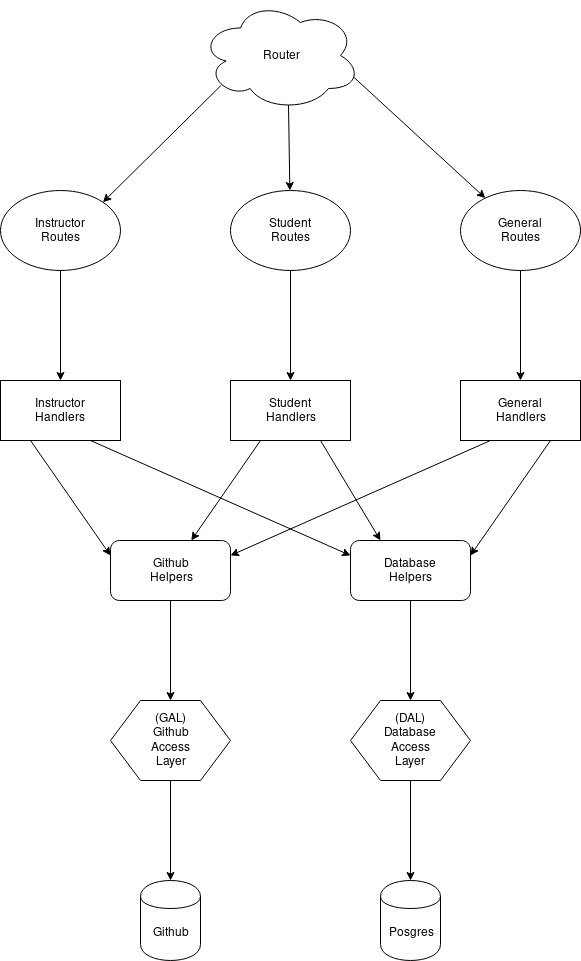
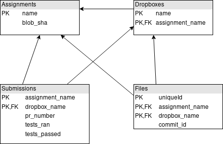

# z3-e2c-api

### Prerequisites

1. Ensure that you have [go](https://golang.org/) installed.
2. Ensure that you have [docker](https://www.docker.com/) installed.
3. Ensure that you have [docker-compose](https://docs.docker.com/compose/install/) installed.


### Installing

To run the API without Docker you have to install its dependencies. Inside of the api root directory, run:
```
go get ./...
```

*Note: the API requires a database connection to successfully boot*
## How to use

### Run the application with docker-compose

Inside of the api root directory, run:

```
docker-compose down && sudo docker-compose up --build
```

## Architecture

### API



*Note: this diagram is a rough draft and omits many details*

### DB



## Authors

* **[Eliot Scott](https://github.com/evscott)** - *Initial work*

See also the list of [contributors](https://github.com/your/project/contributors) who participated in this project.